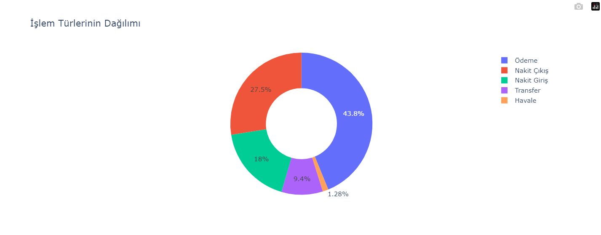
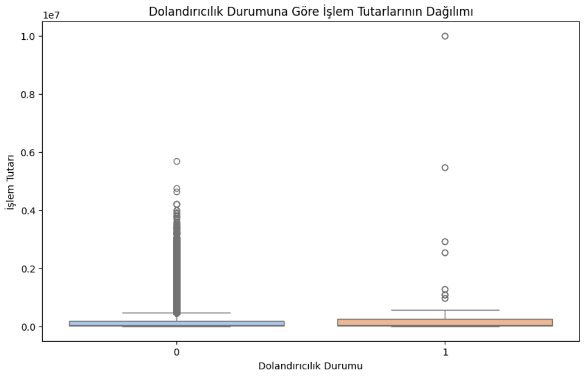
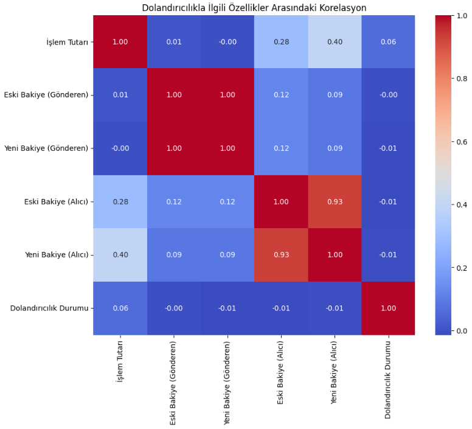
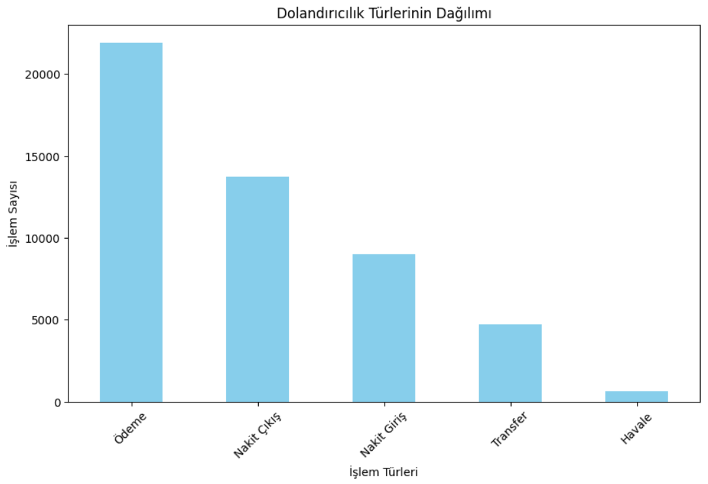

# Banka Dolandırıclık Tespiti
> [!TIP]
> Dependency Requirements: 
> *-numpy
> -pandas
> -seaborn
> -matplotlib.pyplot*

### Pasta Grafiği

### İşlem Dağılımı

### Korelasyon İlişkisi

### İşlem Türleri

